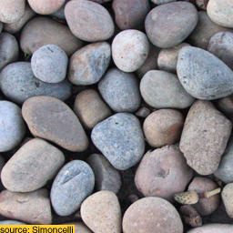
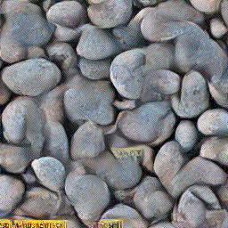

# DeepTextures using PyTorch

This is a re-implementation of the 'Texture Synthesis Using Convolutional Neural Networks' algorithm by Gatys, Ecker & Bethge from 2015 in PyTorch using a default VGG19 model.

## Introduction

This algorithm uses a deep neural network to generate novel, synthetic images that exhibit similar mid-level statistical features as an input image (aka 'texform').

## Output

### Original Image:



### Synthetic 'Texform'



## Methodological Summary

This method works on the responses of 5 different layers of a pre-trained VGG19 model, specifically the first convolutional and the 4 pooling layers.  
At the end of the operation, these layer's responses will be very similar between the original image and the newly synthesized version.  
The synthetic image, the texform, is created by iteratively optimizing a random noise matrix, using a gram-matrix based loss function.
Gram matrices capture the correlations between different features, here they encode textural content.

The output is a novel image that matches certain mid-level statistical ('textural') properties of the original image.

This idea is conceptually somewhat related to 'Neural Style Transfer' and uses similar concepts.
However, neural style transfer optimizes both a content loss function and a style loss function in order to synthesize a combined image.
Also, it does not work on a textural donor and random noise matrix, but a content donor image and a separate style donor image.

## Implementation Details

A comprehensive toolbox is overkill for this project, especially as it is primarily intended for showcasing purposes rather than extensive use.
For simplicity's sake, [this Jupyter Notebook](DeepTextures.ipynb) focuses on the core functionality and a clear, streamlined walkthrough.

## References

### Original Publication

```plain
Texture Synthesis Using Convolutional Neural Networks", Gatys, Ecker, Bethge, NIPS 2015, http://arxiv.org/abs/1505.07376
```

[arXiv.org Link](http://arxiv.org/abs/1505.07376)

### Original Code

The original caffe implementation can be found in this [repo by the first author](https://github.com/leongatys/DeepTextures)

## License

This code is a re-implementation of the original code concept using a new framework.  
This repository carries a MIT license.
